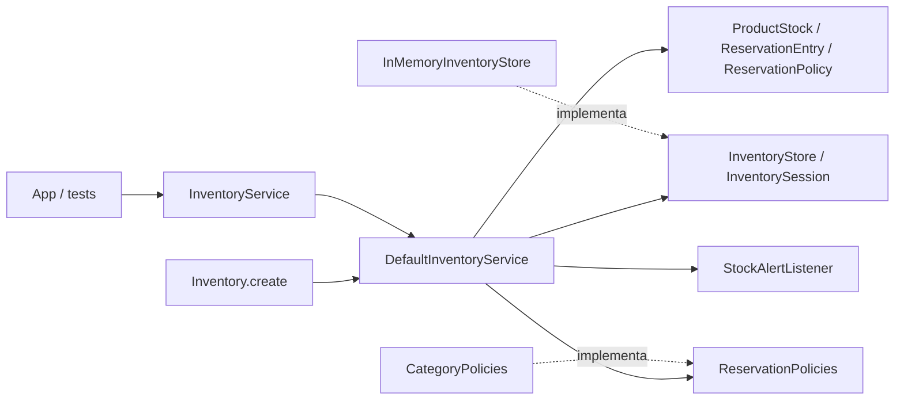

# Arquitectura hexagonal ligera

La aplicación tiene dos cambios de infraestructura previstos por el reto: persistencia en una base de datos y nuevos canales de aviso. Una arquitectura hexagonal ligera permite separar esos cambios de las reglas de reserva, sin introducir un framework ni desplegar servicios adicionales.

## Responsabilidades

| Parte | Responsabilidad |
| --- | --- |
| `api` | Contrato existente; no se modifica. `InventoryService` es el puerto de entrada y `StockAlertListener` es el puerto de notificaciones. |
| `domain` | Invariantes del stock, transiciones de reserva y duración/límite de una política. No utiliza mapas, bloqueos, correo ni almacenamiento. Reutiliza los tipos y excepciones del contrato. |
| `application` | Coordina cada caso de uso, consulta el reloj y publica el aviso al terminar la operación exclusiva. |
| `application.port` | Define acceso exclusivo al almacenamiento, acceso a su estado y resolución de políticas. |
| `infrastructure.memory` | Implementa mapas, bloqueo y cola de vencimientos. |
| `Inventory.create` | Punto de composición: construye y conecta las dependencias concretas. |

## Aplicación de SOLID

- **S — Responsabilidad única:** el servicio coordina; `ProductStock` contabiliza; `ReservationEntry` controla el ciclo de vida; el adaptador guarda y protege los datos.
- **O — Abierto a extensión:** otro registro de políticas se inyecta mediante `ReservationPolicies`; el servicio no contiene un `switch` de categorías. Una categoría nueva exige ampliar el enum público por sus propietarios y registrar su política, sin cambiar los casos de uso.
- **L — Sustitución:** cualquier `InventoryStore` debe garantizar acceso exclusivo equivalente y no dejar escapar objetos mutables. Una implementación que use mapas concurrentes sin proteger la operación completa incumpliría ese contrato. Las pruebas actuales verifican el adaptador en memoria; un futuro adaptador necesita las mismas pruebas de comportamiento más pruebas de integración.
- **I — Segregación:** el contrato para resolver políticas es independiente del almacenamiento. `InventoryStore` delimita la operación exclusiva y `InventorySession` contiene únicamente las operaciones de datos que usa la aplicación.
- **D — Inversión de dependencias:** el servicio recibe contratos de almacenamiento, políticas y avisos. No instancia el adaptador de memoria ni conoce un proveedor de correo. Las dependencias concretas se conectan en la fábrica.

## Por qué la operación completa debe ser exclusiva

Reservar requiere comprobar el pedido, comprobar disponibilidad, descontar unidades y registrar la reserva. Proteger cada mapa o método por separado permite que dos clientes vean el mismo stock y ambos lo compren. `executeExclusive` mantiene toda esa secuencia bajo el mismo bloqueo. Los callbacks de notificación se ejecutan después, para que un servicio externo no retenga el bloqueo.

El puerto de almacenamiento garantiza aislamiento y no promete rollback. Los errores esperados de validación ocurren antes de cambiar la nueva reserva o reposición; el vencimiento de pedidos anteriores sí puede procesarse durante una operación que termina rechazada. El adaptador en memoria no intenta recuperarse de errores de proceso o agotamiento de memoria.

## Migración a base de datos

El puerto delimita una unidad de trabajo. Un adaptador persistente deberá cargar y guardar los agregados modificados dentro de una transacción, usando seguimiento de cambios o una sesión que los persista al finalizar. Reemplazar los mapas por consultas sin este mecanismo perdería actualizaciones.

Para coordinar varias instancias se requieren restricciones únicas por pedido, bloqueo de filas o actualizaciones condicionales y una política de reintento de transacciones. Es posible ajustar el puerto a la tecnología elegida; esta separación facilita la migración, pero no la convierte en un cambio trivial.

La entrega confiable de avisos exige una outbox transaccional y consumidores idempotentes. El listener actual constituye una integración síncrona de mejor esfuerzo.

No se añaden microservicios, CQRS ni event sourcing: el reto no requiere despliegues separados, modelos de lectura distintos ni reconstrucción del inventario a partir de eventos.
